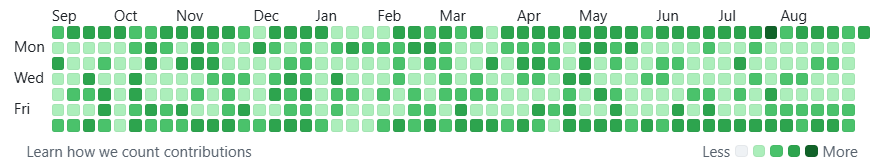
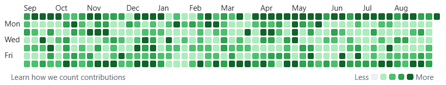

# GitHub Contributions Shade

Before:



After:



[](https://chromewebstore.google.com/detail/github-contributions-shad/mnaidbkjbcdphmkfhkifiecbpiakepka)
[](https://drone.albertyw.com/albertyw/github-contributions-shade)
[](https://qlty.sh/gh/albertyw/projects/github-contributions-shade)
[](https://qlty.sh/gh/albertyw/projects/github-contributions-shade)

<!--
Chrome Web Store description: everything between the BEGIN and END markers is pasted
verbatim into the developer dashboard, so keep it plain text (no Markdown syntax
beyond "- " lists and bare URLs), one line per paragraph, and under 16,000 characters.
-->
<!-- BEGIN STORE DESCRIPTION -->
GitHub Contributions Shade re-shades the contribution calendar on GitHub profile pages using thresholds you choose for each profile, so a single unusual day cannot wash out the rest of the year.

After installing, open the extension's options, add your GitHub username, and reload your GitHub tabs. It does nothing until you do.

WHY

GitHub paints each day of the contribution calendar in one of five shades, and it derives the cutoffs between those shades from the busiest single day in the window. That makes the whole calendar hostage to one number: a single outlier day rescales every other day on the graph.

That is exactly what happened on the profile this extension was built for. One accidental day of 31 contributions, far above any other, pushed GitHub's top cutoff to roughly 24. Across the trailing 371 days, only 5 days reached the darkest shade while 160 sat at the lightest, even though the underlying activity was steady: just one day with no contributions, and the middle half of active days fell between 4 and 17 contributions. The data was fine; the cutoffs were wrong for it.

This extension replaces GitHub's cutoffs with constants you set, so no single day can rescale the others. With cutoffs of 1, 7, 13 and 19, the same year spreads across the five shades as 1, 143, 83, 72 and 72 days.

CONFIGURING

Nothing changes until you add a username. To open the options page, click the puzzle-piece Extensions button in Chrome's toolbar, then the three-dot menu next to GitHub Contributions Shade, then Options. You can also find it under Details in chrome://extensions.

Add the GitHub usernames you want re-shaded (the part after github.com/) and click Save. Each username gets four numbers, Lightest, Medium-light, Medium-dark and Darkest: the fewest contributions in a day that get that shade. The page shows the range each shade ends up covering as you type. A new row starts at:

- Empty: no contributions
- Lightest: 1 to 6 contributions
- Medium-light: 7 to 12 contributions
- Medium-dark: 13 to 18 contributions
- Darkest: 19 or more contributions

The numbers must be whole, at least 1, and each larger than the last. A good starting point is to hover over a few busy days to see their counts, set Darkest around a typical busy day rather than your single busiest, and space the others evenly below it. Profiles you have not listed keep GitHub's own shading. Saved changes show up right away in GitHub tabs opened since the extension was installed or last updated, and removing a username puts GitHub's shading back; reload any GitHub tabs that were already open before that. Settings are kept in Chrome's synced extension storage, so they follow you to other browsers where you are signed in to Chrome with sync turned on.

HOW IT WORKS

- It reads each day's contribution count from the tooltip GitHub already renders, works out which shade that count belongs to, and sets that shade on the day's square.
- It does not override any colors. GitHub's own styles paint the square, so the light, dark, dimmed and colorblind themes all keep working exactly as before.
- The screen-reader description of each day is updated along with its shade, so the two stay consistent.
- Switching between year tabs on the profile, and moving between profiles, is handled automatically.

WHERE IT RUNS

The extension runs on pages at https://github.com/ so that it can find whichever profile you are viewing, but it only changes the calendar of profiles you have listed on the options page. It does nothing on any other website.

PRIVACY

- No data is collected, transmitted, sold or shared.
- The only thing stored is your list of usernames and thresholds, in Chrome's own extension storage. Chrome syncs it through your Google account if you have Chrome sync turned on; it never goes to the developer or anyone else.
- No network requests, no analytics, no cookies.
- Permissions: access to github.com pages, and "storage" for your settings.
- Everything happens inside the page you are already viewing, and the counts it reads are discarded when you leave.

Privacy policy: https://github.com/albertyw/github-contributions-shade/blob/master/PRIVACY.md

OPEN SOURCE

The extension is open source under the MIT license. The source code is about 600 lines of TypeScript and is worth reading before installing anything that touches your browser: https://github.com/albertyw/github-contributions-shade

Bug reports and questions: https://github.com/albertyw/github-contributions-shade/issues
<!-- END STORE DESCRIPTION -->

## How it works

The extension looks up the thresholds saved for the profile being viewed, reads each
day's contribution count out of the tooltip GitHub already renders, recomputes which
shade level that count belongs to, and writes the level back onto the cell:

```
 options page ──save──► chrome.storage.sync  { users: { "albertyw": [1, 7, 13, 19] } }
                                 │ get on load, onChanged
                                 ▼
 page load / AJAX swap / settings change
            │
            ▼
  profileLogin("/AlbertYW") → "albertyw" → [1, 7, 13, 19]
            │                   (no entry → restore GitHub's levels, stop)
            ▼
  querySelectorAll("td.ContributionCalendar-day")
            │ per cell
            ▼
  tool-tip[for=<cell.id>]  ──►  "20 contributions on August 31st."
            │                              │ parseCount()
            ▼                              ▼
    levelFor(20, [1, 7, 13, 19])  ◄────────┘
            │
            ▼  level 4
  cell.dataset.level = "4"
  cell.setAttribute("aria-describedby", "…legend-level-4")
            │
            ▼
  GitHub's own CSS repaints the square
```

Nothing about the page's colors is overridden.  The extension only changes which
*level* a day belongs to and lets GitHub paint it, so the light, dark, dimmed and
colorblind themes all keep working exactly as they do without the extension.
`aria-describedby` is updated alongside `data-level`, so the screen-reader description
of a day stays consistent with its shade.

The first time a cell is changed, GitHub's own level is saved in
`data-shade-original-level`.  When the profile has no entry, which includes right after
it is removed on the options page, those cells are put back to GitHub's level.

A `MutationObserver` re-runs the sweep when GitHub replaces part of the page — switching
year tabs swaps the calendar over AJAX, and the tooltips are appended after the table
renders.  It watches `childList` only, never attributes, so the extension's own writes
cannot retrigger it.  A `chrome.storage.onChanged` listener re-runs it when the settings
change.

## Configuring thresholds

Thresholds are set per GitHub username on the extension's options page.  Each username
gets four whole numbers, Lightest to Darkest, each at least 1 and larger than the last:
the fewest daily contributions for `data-level` 1 through 4.  New rows start at `DEFAULT_THRESHOLDS`
(`1, 7, 13, 19`) from `src/shade.ts`.  Usernames are stored lowercase, because GitHub
serves `/AlbertYW` and `/albertyw` as the same profile.  Profiles without an entry keep
GitHub's shading.

Settings are stored in `chrome.storage.sync` under one key:

```json
{ "users": { "albertyw": [1, 7, 13, 19] } }
```

## Development

### Layout

- `src/` — TypeScript sources.
  - `shade.ts` — the logic: parse a count, bucket it into a level, apply or restore
    levels in a DOM subtree.  Pure DOM manipulation with no extension APIs, which is
    what makes it testable outside an extension host.
  - `settings.ts` — validates usernames and thresholds, parses stored settings, and
    reads the profile login from a URL path.  Also free of extension APIs.
  - `content.ts` — the content script: loads settings, sweeps, and installs the
    observer and the settings listener.
  - `options.ts` — the options page logic, with storage passed in so tests can use a
    fake.
  - `options-page.ts` — the options page entry point, which hands `options.ts` the
    real `chrome.storage.sync`.
  - `icon.png` — the icon as originally drawn, kept as the design reference.
- `github-contributions-shade/` — the extension itself, and the directory that gets
  zipped.
  - `manifest.json` — Manifest V3 declaration.
  - `options.html` — the options page.
  - `github-contributions-shade.min.js` and `options.min.js` — webpack output, not
    checked in.
  - `icons/` — `icon16.png`, `icon32.png`, `icon48.png` and `icon128.png`, the four
    sizes Chrome asks for.
- `test/` — WebdriverIO browser tests run with Mocha.
- `webpack.config.ts` — bundles `src/content.ts` and `src/options-page.ts` into the
  extension directory.

### Setup

```
pnpm install
```

Node >=22.18 is required (see `engines` in `package.json`).

### Common commands

| Command             | What it does                                          |
| ------------------- | ----------------------------------------------------- |
| `pnpm run build`    | Bundle the scripts into the extension directory       |
| `pnpm run eslint`   | Lint sources, tests and config                        |
| `pnpm run tsc`      | Type check                                            |
| `pnpm run wdio`     | Run the WebdriverIO test suite                        |
| `pnpm test`         | `build` + `eslint` + `tsc` + `wdio`                   |
| `pnpm run package`  | Clean, build, and produce the zip                     |
| `pnpm run clean`    | Remove the built bundle and the zip                   |

### Browsers

The test suite runs in Chrome.

WebdriverIO would otherwise download its own Chrome for Testing build and a matching
chromedriver, and Google publishes those only for `linux-x86_64` — on arm64 the download
produces a binary that cannot execute.  So `wdio.conf.ts` looks for an already installed
Chrome or Chromium first, checking the usual locations including snap's.  Nothing needs
configuring on a machine that has a browser installed.

`CHROME_BINARY` and `CHROMEDRIVER_BINARY` override that search, which is how CI points
at the Chromium its image installs.  `CHROME_BINARY` must be the real executable rather
than a launcher wrapper: snap's `/snap/bin/chromium` is a wrapper, and the executable
lives at `/snap/chromium/current/usr/lib/chromium-browser/chrome`.

### Loading the extension locally

To try a development build, install it unpacked.

1. `pnpm run build`
2. Open `chrome://extensions` and enable **Developer mode**
3. Click **Load unpacked** and select the `github-contributions-shade/` directory
4. Click **Details** on the extension, then **Extension options**, add a GitHub
   username, and click **Save**
5. Visit that user's profile and look at the contribution calendar

## Testing

```
pnpm test
```

## Releasing a New Version

The extension is distributed through the Chrome Web Store.

1. Update `CHANGELOG.md`
2. Bump the version in `package.json` and `github-contributions-shade/manifest.json`
3. Commit and tag the release
4. `pnpm run package` to produce `github-contributions-shade.zip`
5. Upload the zip in the [Chrome Web Store developer dashboard](https://chrome.google.com/webstore/devconsole/)

## License

MIT — see [LICENSE](LICENSE).
